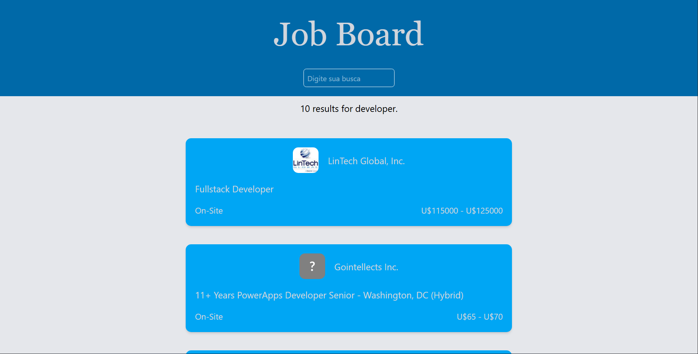
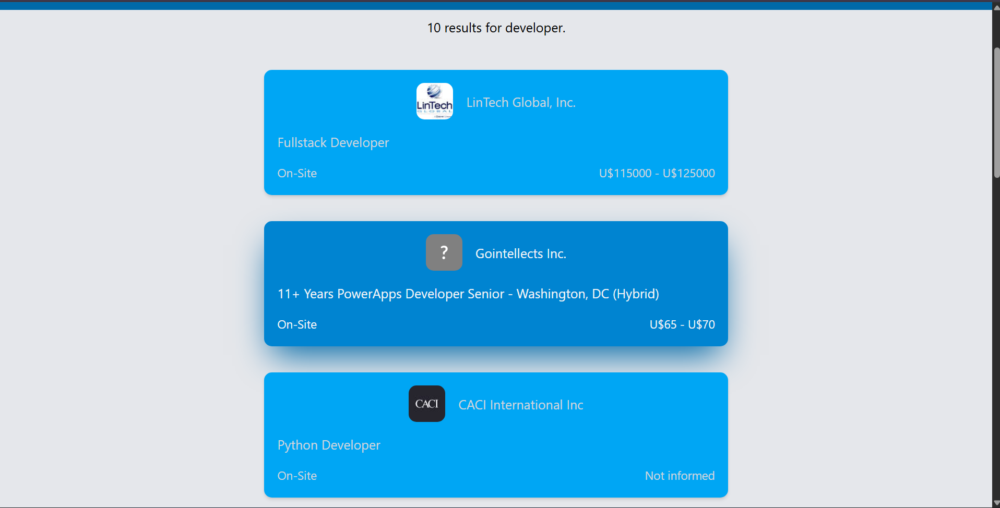

# 💼 Job Board

Aplicação web para busca de vagas de emprego, desenvolvida com React, TypeScript e Tailwind CSS, integrada à API [JSearch (RapidAPI)](https://rapidapi.com/letscrape-6bRBa3QguO5/api/jsearch).

---

## 📸 Screenshots

### Página Principal


### Lista de Vagas


### Detalhes da Vaga


---

## 🚀 Tecnologias Utilizadas

- [React](https://react.dev/) — biblioteca para construção de interfaces
- [TypeScript](https://www.typescriptlang.org/) — tipagem estática para JavaScript
- [Tailwind CSS](https://tailwindcss.com/) — estilização utilitária
- [React Router DOM](https://reactrouter.com/) — roteamento client-side
- [Vite](https://vitejs.dev/) — bundler e servidor de desenvolvimento
- [JSearch API](https://rapidapi.com/letscrape-6bRBa3QguO5/api/jsearch) — fonte de dados de vagas em tempo real

---

## ✨ Funcionalidades

- Listagem de vagas de emprego em tempo real
- Busca por termo com debounce
- Página de detalhes de cada vaga com descrição completa
- Link direto para candidatura
- Tratamento de estados de loading e erro
- Layout responsivo

---

## ⚙️ Como Rodar Localmente

### Pré-requisitos

- Node.js instalado
- Conta na [RapidAPI](https://rapidapi.com) com acesso à API JSearch

### Passo a Passo

1. Clone o repositório:
```bash
git clone https://github.com/seu-usuario/job-board.git
cd job-board
```

2. Instale as dependências:
```bash
npm install
```

3. Crie um arquivo `.env` na raiz do projeto:
```env
VITE_RAPIDAPI_KEY=sua_chave_aqui
```

4. Inicie o servidor de desenvolvimento:
```bash
npm run dev
```

5. Acesse `http://localhost:5173` no navegador.

---

## 📁 Estrutura do Projeto

```
src/
├── components/
│   ├── Header.tsx
│   ├── JobCard.tsx
│   ├── JobDetails.tsx
│   ├── JobList.tsx
│   └── Footer.tsx
├── context/
│   └── JobContext.tsx
├── hook/
│   └── useJobs.ts
├── utils/
│   └── api.ts
├── types.ts
└── App.tsx
```

---

## 👨‍💻 Autor

Leonardo Zani de Souza — 2026
